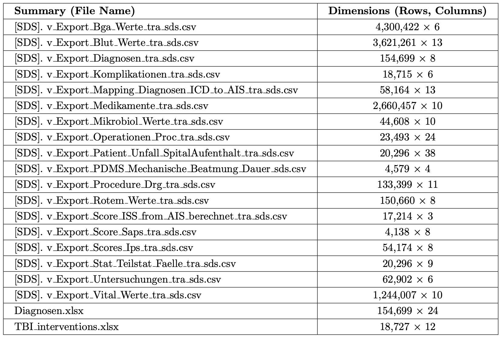

# 🧠 Traumatic Brain Injury in Polytrauma Patients: Statistical Analysis

## 📌 Summary

This repository presents the results of a collaborative analysis between the **ETH Zürich MSc Statistics program** and the **Department of Traumatology at the University Hospital Zurich**. The goal is to understand how **Traumatic Brain Injury (TBI)** influences the broader **pathophysiology in polytrauma patients**, using real-world hospital data.

Over **7,000 anonymized patient records** from 2012 to 2020 were analyzed using:

- Generalized Linear Mixed Models (GLMMs)
- Robust linear models

The analysis revealed a **strong association between TBI severity (measured by Glasgow Coma Scale)** and key physiological disruptions, such as:

- Circulatory shock
- Coagulopathy
- Hypothermia
- Soft tissue damage

The results provide **clinical insights and actionable recommendations** for trauma management and future research.

---

## 📂 Repository Structure

```text
.
├── 01_raw_data/              # Raw input data (user must provide manually)
│   └── .gitkeep
├── 02_clean_data/           # Cleaned datasets (produced by preprocessing scripts)
│   └── .gitkeep
├── 03_spreadsheets/         # Temporary spreadsheet path (used by 01_clean_diagnosen+mapping.Rmd)
│   └── .gitkeep
├── 04_cleaning_notebooks/   # Data cleaning RMarkdown notebooks
│   ├── 01_clean_diagnosen+mapping.Rmd
│   ├── 01_clean_iss+interventions.Rmd
│   ├── 01_clean_vital+lab+patients.Rmd
│   ├── 01_table4_01.Rmd
│   ├── 03_table1_01.Rmd
│   └── master_data_prep.R
├── 05_Exploration/          # Exploratory data analysis and issue identification
│   ├── 02_data_issues_02.Rmd
│   ├── 02_explore_Inter_AIS.R
│   ├── 02_explore_data_02.Rmd
│   └── Random_diagnosis_evaluation.R
├── 06_Models/               # Statistical modeling and correlation analysis
│   ├── 04_OLD_explore_circ_temp_inr.Rmd
│   ├── 04_Quick_Temp_Models.R
│   ├── 04_Soft_Tissue_Damage.Rmd
│   ├── 04_models_pph_overall_01.Rmd
│   ├── 04_sf_ordinal.Rmd
│   ├── data_prep.R
│   ├── models_references.bib
│   ├── pathophysiology_correlations_03.Rmd
│   └── vancouver.csl
├── 07_Report/               # Final project report and bibliographic files
│   ├── Report_final.Rmd
│   ├── Report_final_html.Rmd
│   ├── Report_final_pdf.Rmd
│   ├── report_references.bib
│   └── vancouver.csl
├── .gitignore
├── Brain_Injury.Rproj       # RStudio project file


---
## 📥 How to Add Your Data

The required patient-level dataset is **not included** in this repository due to privacy and confidentiality restrictions. The user must **manually insert** the data into the `01_raw_data/` directory.

### 🖼️ Data File Structure

To visualize the expected structure and file names, refer to the following image:




## 📊 About `03_spreadsheets/`

The folder `03_spreadsheets/` is used within the cleaning scripts `01_clean_diagnosen+mapping.Rmd` and `01_clean_vital+lab+patients.Rmd` as a **temporary inspection path**. You **do not** need to manually add or modify anything inside this folder.

---

## 🧹 Data Cleaning Workflow

All raw data must undergo preprocessing before modeling. The cleaning process is documented in a series of RMarkdown notebooks located in the `04_cleaning_notebooks/` folder. These scripts handle tasks such as:

- Diagnoses processing (`Diagnosen.xlsx`)
- Intervention and ISS data cleaning
- Patient vitals, lab values, and demographic info

You can run individual scripts as needed (e.g., `01_clean_diagnosen+mapping.Rmd` for diagnoses), which will clean and save specific datasets. However, since the cleaning process is **not the main focus** of this project, we provide a **master script** that runs the entire cleaning pipeline:

```r
source("04_cleaning_notebooks/master_data_prep.R")


---
## 🧹 Data Cleaning Workflow (continued)

✅ After running the script, check that the cleaned files are correctly stored in:


---

## 🔍 05_Exploration/

The `05_Exploration/` folder contains various exploratory scripts we used to inspect and better understand the raw data. These analyses were helpful for identifying data inconsistencies, variable behavior, and modeling challenges.

> ℹ️ This section is **less critical** for drawing final conclusions. It was primarily used for internal data comprehension.  
A more focused and concise overview of key findings will be provided later in this README.

---

## 🧠 06_Models/

The `06_Models/` folder contains scripts and notebooks used to implement and test various statistical models, including:

- Generalized Linear Mixed Models (GLMMs)
- Robust regression models
- Correlation analyses related to pathophysiological outcomes

Users are welcome to explore these scripts for detailed implementation.  
However, **the final versions of the models and their results are fully documented in the report** provided in the next section.

> 📌 A structured overview of the modeling approach will also be summarized further down in this README.

---

## 📄 07_Report/ — Final Results

The most important deliverable of this project is the **final report**, which consolidates all key results, methodology, and interpretation.

The report is provided in the following formats:

- 📄 **PDF**: `07_Report/Report_final_pdf.Rmd`
- 🌐 **HTML**: `07_Report/Report_final_html.Rmd`

> ✅ These files represent the complete, finalized analysis and can be used independently to understand the study’s outcomes and implications.

---


